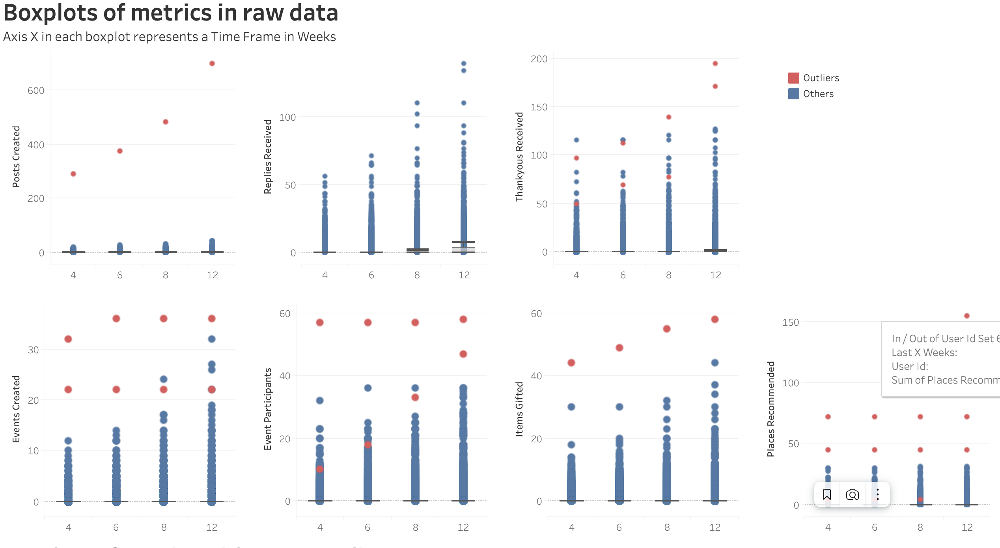

# Consulting on Gamification Badge Criteria for nebenan.de

## Outliers

## Distributions

  
Posts Created

  

  
Replies Recieved

  

  
Thankyous Recieved

  

  
Events Created

  

  
Events Participants

  

  
Items Gifted

  

  
Places Recommended

  

## Heatmaps

