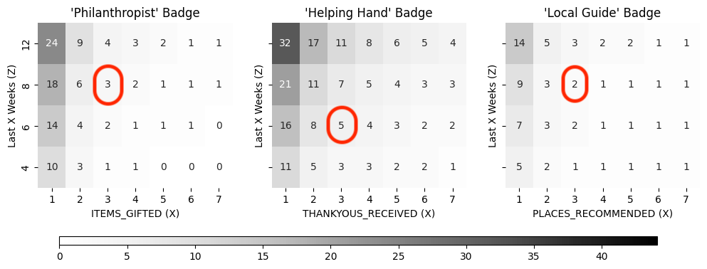

# Consulting on Gamification Badge Criteria for nebenan.de

## Additional Files for this Report

1. [Jupyter Notebook](https://github.com/akseshina/nebenan_task/blob/main/nebenan_task.ipynb) with code for analysis. The sections in the Jupyter Notebook correspond to the sections in this report.

2. [Tableau Dashboard](https://public.tableau.com/app/profile/margarita.akseshina/viz/NebenanTask/Dashboard1) with some interactive visualizations, which were easier and faster to create in Tableau than in Python.

## Data overview

Let's start by looking at the file. It contains information about 20,000 users.

The fields contain a lot of Nulls. I assumed that in such cases, the user did not perform specific actions, and their count can be considered as 0. For further analysis, I replaced all Nulls in the dataset with zeros. I also saved this updated dataset to a new file to make it easier to visualize in Tableau. (See the "Fill the dataset with zeros instead of Nulls" section in [the Jupyter Notebook](https://github.com/akseshina/nebenan_task/blob/main/nebenan_task.ipynb))

I also checked that for each user, the metric value does not decrease with an increase in the length of the time frame. All data passed this check. (See the "Checking Metric Monotonicity" section in [the Jupyter Notebook](https://github.com/akseshina/nebenan_task/blob/main/nebenan_task.ipynb))

### Outliers

Let's draw box plots for each metric, separately for each time interval.

This method of visualization allows us to see outliers.

On the graphs, I highlighted users who I consider outliers in red (I selected them manually using interactive Tableau plots). There are 10 such users.

The following picture shows the same box plots but on a dataset filtered from these 10 users.

All further analysis was conducted on these filtered data. These outliers would not have a significant effect on further analysis and the selection of parameters, but their filtering at least made the visualization of distributions using box plots more clear. We can see that each of the metrics represents a distribution with a very long tail and a median at zero or close to it. 

## Metrics Distributions

Now, let's visualize the distribution of each metric as a normalized histogram. I do not show values greater than 7 on these histograms, as the number of active users with values greater than that decreases significantly. Thus, I cut off the long tails of the distributions and suggest focusing on their left side.

On each graph, I also highlighted in purple the percentage of users for whom a particular metric is zero. From the histograms, we can see that the vast majority of users are not very active and may not perform any actions even in 12 weeks. Therefore, it is not advisable to choose values of X and Y for the criteria too high, as such behavior would be highly untypical given the current user activity.

To avoid overloading the report with a large number of plots, you can expand and collapse each histogram set for each metric as needed.

  
Posts Created

  

  
Replies Recieved

  

  
Thankyous Recieved

  

  
Events Created

  

  
Events Participants

  

  
Items Gifted

  

  
Places Recommended

  

## Choosing parameters for the criteria

So, how do we choose parameters for the criteria?

### Getting a badge should not be too easy

On the previous histograms, we saw that the vast majority of users do not perform certain actions. However, if we choose the parameter X too low, for example, 1, it can devalue the badge. A user may not understand why they were awarded a badge if they did something only once (and perhaps even accidentally while testing the platform). Therefore, I suggest considering a minimum of 2 or 3 as X. The specific choice between these values should be discussed within the team, based on the product's philosophy and strategy. I chose a minimum of 3 for X, but this is just a preliminary suggestion, and I will show how we can evaluate other options.

### Two of the badges, besides parameters X and Z, also have a parameter Y

Unfortunately, the current data aggregation does not allow us to understand some details. For example, if a user has 3 posts and 3 replies, is it one reply to each post, or only the first 3 replies, and no one commented on the other 2 posts? We cannot determine this from the current data. But let's introduce at least minimal necessary conditions - if we assume that a conversation starts when a post has at least 1 reply, then the number of Y replies should not be less than the number of X posts. If we assume that an event occurred if it had at least one participant, then the number of Y participants should not be less than the number of Y events planned. Then, if in the previous step, we fixed a minimum X value of 3, then the minimum for Y should also be 3.

### Getting a badge should not be too hard

How can we determine if a particular criterion will be achievable for users? We can understand from our observed sample what percentage of users currently meet the criterion.

Let's go through all the parameter values within reasonable limits (for X and Y, I did not consider more than 7) and calculate this ratio. I visualized the results of this iteration in the form of a heatmap.

For badges with two parameters, there is one heatmap.

For badges with 3 parameters, there are 4 of them (one for each time interval).

The intensity of a cell shows the percentage of users who will receive a badge given these parameters.

Thus, based on our strategy and philosophy (again, it's better to discuss this together as a team), we can choose parameters based on the ratio of users we want to award a badge to.

On these heatmaps, I subjectively selected values in red that I considered acceptable. Since I had already suggested taking X and Y not less than 3, the heatmaps only helped me choose the time frame (not too long where possible, but also enough time for at least some users to receive a badge). 

But, as you can now see, we can adapt the strategy and assess how the results would look with a different choice of parameters. For example, if a product manager suggests making the Z parameter the same for all criteria to avoid confusing users, then we can fix Z and see which X and Y parameters would be suitable.

## Conclusions and further questions

Let's finalize the criteria that I visually showed in the previous section on the heatmaps:

- Event Planner: At least 3 events with 3 participants in 12 weeks.
- Conversation Starter: At least 3 posts with 3 replies in 8 weeks.
- Philanthropist: At least 3 items gifted on the marketplace in 8 weeks.
- Helping Hand: At least 3 thankyou messages received in 6 weeks.
- Local Guide: At least 3 places recommended in 8 weeks.

In this table, you can see what percentage of users from the dataset will receive a badge or a set of badges given these criteria.

As you can see, the percentage for each badge is quite small, and the number of people who would receive more than one badge is very few.

Finally, I would like to emphasize again that the final decision on the criteria should be made depending on the product strategy, together with the team and the product manager, and my heatmaps with parameter iterations should help in this.
